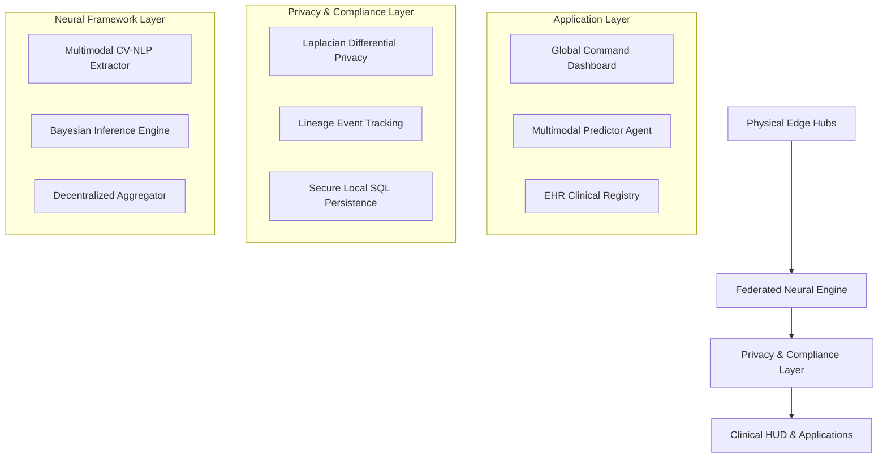

# ⚖️ DermaGnosis — Distributed Clinical Intelligence & Federated Learning
Operationalizing Explainable AI (XAI) and Privacy-Preserving Machine Learning for high-risk clinical software.

Python FastAPI React Federated-Learning GDPR EU-AI-Act Bayesian-XAI

[]()
[]()
[]()

---

## 🖼️ Visual Gallery

### 1. Neural Inception (System Initialization)


### 2. Multi-modal Predictor Lab


### 3. Federated Learning Mesh


---

## 📋 Overview
**DermaGnosis** is an advanced medical Explainable AI (XAI) platform designed to revolutionize the early detection of melanoma. It operationalizes high-fidelity diagnostics across a network of distributed clinical nodes using a **Federated Learning** architecture. This platform is built to mitigate the "black box" risks in clinical AI, ensuring that all machine learning decisions are fully auditable, deeply interpretable, and compliant with sweeping ethical guidelines like the General Data Protection Regulation (GDPR) and the EU AI Act.

---

## 🎯 The Problem
The integration of Machine Learning into clinical oncology frequently encounters critical systemic barriers:
- **The Privacy-Precision Paradox:** Centralizing highly sensitive dermoscopic images for AI training invites severe regulatory friction and privacy threats.
- **The Decision Dilemma:** Algorithms that propose critical interventions (e.g., surgical excisions) without providing interpretable clinical justification force physicians into a dangerous choice between blind trust and total rejection.
- **Algorithmic Bias:** Opaque models may rely on spurious correlations or fail on unrepresented demographics without being detected.
- **Severe Non-Compliance Penalties:** Operating unexplainable AI systems under the EU AI Act can result in fines reaching up to €35 million or 7% of global annual turnover.

---

## ✅ The Solution
DermaGnosis transforms classical "black box" neural networks into transparent "glass boxes." It employs a multi-layered security and architectural framework to safely distribute intelligence while enforcing algorithmic accountability:

| Control | XAI / Security Method | Objective & Audit Scope | Target Regulation |
| :--- | :--- | :--- | :--- |
| 🧬 **Privacy** | FedAvg + DP ($\epsilon$-noise) | Protects distributed weight synchronization from membership inference | GDPR Art. 32 |
| 🔍 **Transparency** | Bayesian Posteriors | Exposes individual feature impact for algorithmic justification | GDPR Art. 22 |
| 🔬 **Inspection** | Radiomics Feature Extraction | Quantifies spatial morphological cues (Asymmetry, Border, Color) | EU AI Act Art. 13 |
| 🧪 **Auditability** | FIFO Lineage Tracking | Generates an immutable, chronological trail for all diagnostic events | EU AI Act Art. 17 |

---

## 🏗️ Architecture
The platform operates on a specialized 4-layer **Clinical Mesh**, combining physical distribution with rigorous neural auditing.



---

## 📂 Project Structure
```text
dermagnosis-federated-learning/
├── main.py                    # Core Production API (FastAPI)
├── fl_server.py               # Central Federated Learning Aggregator
├── fl_client.py               # Edge Node Simulation Client
├── requirements.txt           # Python backend dependencies
├── dermagnosis.db             # Local secure Clinical Registry (SQLite)
├── assets/                    # Presentation and gallery assets
│   └── gallery/               
│
├── modules/                   # 🧠 Core Algorithmic Systems
│   ├── core/
│   │   ├── cv_nlp_pipeline.py    # Hybrid CV-NLP extraction
│   │   ├── bayesian_inference.py # Risk mapping and evidence fusion
│   │   ├── fl_engine.py          # Secure Multi-party Computation
│   │   └── image_pipeline.py     # Deterministic Radiomics evaluation
│
└── frontend/                  # ⚛️ Next-Gen Command Center (React)
    ├── package.json           # Node dependencies
    ├── vite.config.js         # Frontend bundler configuration
    ├── index.html             # React Application entry point
    └── src/
        ├── App.jsx            # Routing and Global State
        ├── index.css          # Tailwind & custom CSS rules
        └── components/        # Isolated modular interfaces
            ├── LandingPage.jsx  # Frame-by-frame animated initialization
            ├── Dashboard.jsx    # Real-time telemetry monitoring
            ├── Predictor.jsx    # Central Diagnostic Hub
            ├── ClinicalData.jsx # Patient Registry viewer
            └── FLSimulation.jsx # Federated Learning Mesh Tracker
```

---

## 🚀 Quick Start
### 1. Initialize the Core Backend
Ensure you are using Python 3.10+.
```bash
# Clone the repository
git clone https://github.com/FilippeZ/dermagnosis-federated-learning.git
cd dermagnosis-federated-learning

# Create and activate a virtual environment
python -m venv venv
source venv/bin/activate  # Or `venv\Scripts\activate` on Windows

# Install critical dependencies
pip install -r requirements.txt

# Launch the secure API
python main.py
```

### 2. Launch the Command Center
Ensure you are using Node.js 18+.
```bash
# Navigate to the frontend directory
cd frontend

# Install Node modules
npm install

# Start the Vite development server
npm run dev
```

---

## ⚖️ Regulatory Compliance & Governance

### Mapping to European Law
| Regulation | Article | Requirement | DermaGnosis Feature |
| :--- | :--- | :--- | :--- |
| **GDPR** | Art. 22 | Right to Explanation | Bayesian Posterior + Radiomics attribution allows clinicians to contest AI decisions. |
| **EU AI Act** | Art. 9 | Risk Management System | Counterfactual metrics mapped into high/low risk intervals. |
| **EU AI Act** | Art. 13 | Transparency to Users | Visual Predictor HUD displaying clinical NLP overrides. |
| **EU AI Act** | Art. 14 | Human Oversight | System designed as "Human-in-the-Loop" for physician validation. |

### Black Box Risks Mitigated
| Risk Type | Severity Rating | XAI / Security Mitigation |
| :--- | :--- | :--- |
| **Opaque Decisions** | 🔴 Critical | Bayesian Confidence Intervals |
| **Data Leakage** | 🔴 Critical | Federated Decentralized Architecture |
| **Clinical Trust Gap**| 🟠 High | Real-time dynamic logic contribution display |
| **Audit Failures** | 🟠 High | Strict FIFO Event Lineage Tracking |

---

## 🛠️ Technology Stack
- **Machine Learning & Simulation**: PyTorch, NumPy, PIL, SciPy
- **Federated Engine**: Custom FedAvg implementation with Differential Privacy mechanisms
- **Secure Persistence**: FastAPI, strictly typed Pydantic models, SQLite3
- **Frontend Architecture**: React 18, Vite, TailwindCSS (Clinical Dark Theme), Framer Motion, Recharts

---

## 📄 License
This project is licensed under the MIT License — see `LICENSE` for details.

---

## 👤 Author
**Philippos-Paraskevas Zygouris**

*Making clinical AI transparent, auditable, and legally compliant — one explanation at a time.*
