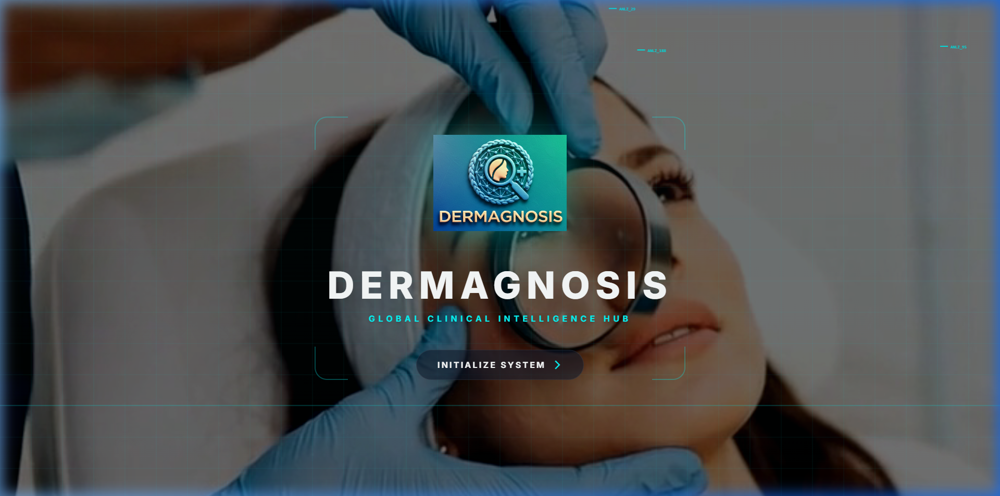
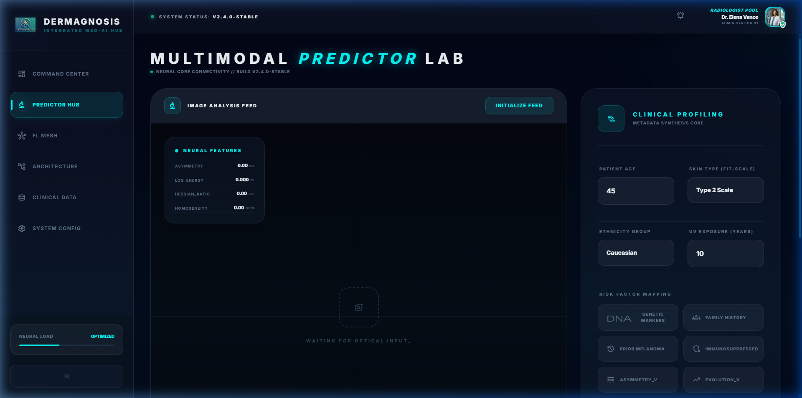
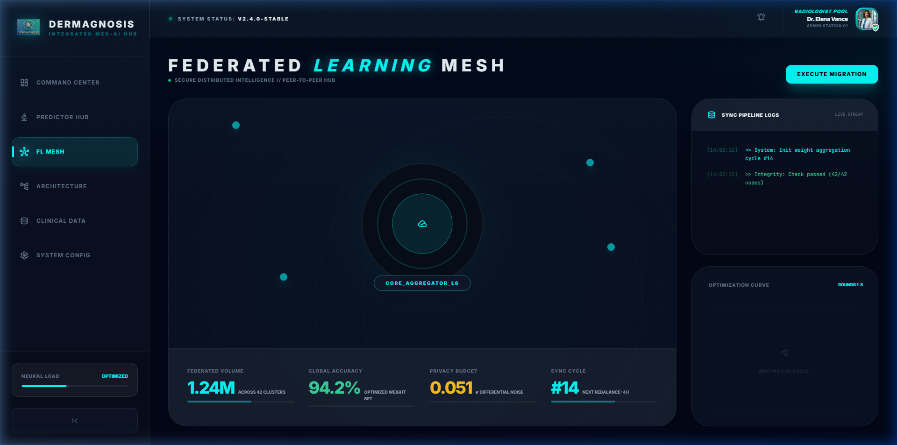
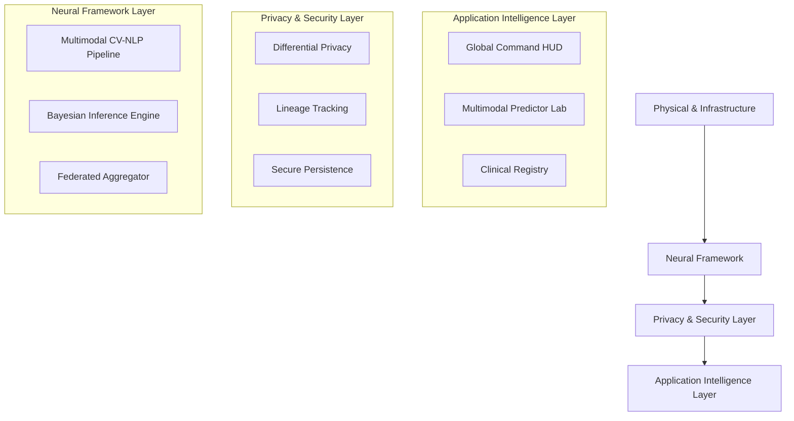

# ⚖️ DermaGnosis — Distributed Clinical Intelligence & Federated Learning
Operationalizing Federated AI and Bayesian XAI for high-risk melanoma diagnostics

Python FastAPI React Federated-Learning GDPR EU-AI-Act Bayesian-XAI

[]()
[]()

---

## 🖼️ Visual Gallery

### 1. Neural Inception (Landing Page)


### 2. Multi-modal Predictor Lab


### 3. Federated Learning Mesh


---

## 📋 Overview
**DermaGnosis** is a next-generation medical XAI (Explainable AI) platform designed to revolutionize early melanoma detection. It operationalizes high-fidelity diagnostics across distributed clinical nodes using a **Federated Learning** architecture, ensuring that all AI-driven decisions satisfy GDPR and EU AI Act mandates for high-risk medical software.

---

## 🎯 The Problem
Modern AI in oncology often operates as a "black box" with significant risks:
- **Privacy Paradox:** Centralizing sensitive dermoscopic images for AI training introduces massive regulatory friction (GDPR/HIPAA).
- **Decision Dilemma:** An algorithm recommending treatment without clear justification forces clinicians to choose between blind trust or rejection.
- **Data Silos:** High-quality clinical data is trapped in local institutions, limiting the robustness of centralized models.
- **Compliance Risk:** Non-compliant AI systems face extreme penalties under the EU AI Act (up to €35M).

---

## ✅ The Solution
DermaGnosis transforms opaque diagnostics into transparent "glass boxes" using a multi-layered security and explainability framework:

| Control | Method | What It Audits | Regulation |
| :--- | :--- | :--- | :--- |
| 🧬 **Privacy** | FedAvg + DP | Global weight synchronization without raw data leakage | GDPR Art. 22 |
| 🔍 **Transparency** | Bayesian Posteriors | Feature-level contribution to diagnostic certainty | EU AI Act Art. 13 |
| 🔬 **Visual Inspection** | Radiomics Extraction | Spatial attribution of malignant morphological features | EU AI Act Art. 13 |
| 🧪 **Auditability** | Data Lineage | Chronological FIFO tracking of every diagnostic event | EU AI Act Art. 17 |

---

## 🏗️ Architecture
The project follows a 4-layer **Clinical Mesh** architecture designed for medical-grade reliability:



---

## 📂 Project Structure
```text
derma-gnosis/
├── main.py                    # Production FastAPI entry point
├── fl_server.py               # Federated Learning central aggregator
├── fl_client.py               # Edge node training client
├── requirements.txt           # System dependencies
├── dermagnosis.db             # Persistent clinical registry (SQLite)
├── modules/                   # 🆕 Core Intelligent Systems
│   ├── core/
│   │   ├── cv_nlp_pipeline.py # Multimodal feature extraction
│   │   ├── bayesian_inference.py # Diagnostic logic & XAI scores
│   │   ├── fl_engine.py       # Simulation & aggregation logic
│   │   └── image_pipeline.py  # Radiomics processing
├── frontend/                  # React Command Center
│   ├── src/
│   │   ├── components/        # Dashboard, Predictor, FL Mesh modules
│   │   └── App.jsx            # Dynamic hub orchestration
└── assets/gallery/            # Clinical visualizations & documentation
```

---

## 🚀 Quick Start
### 1. Initialize Backend
```bash
# Install dependencies
pip install -r requirements.txt

# Start specialized medical API
python main.py
```

### 2. Launch Command Center
```bash
cd frontend
npm install
npm run dev
```

---

## ⚖️ Regulatory Compliance

| Article (GDPR/EU AI Act) | Requirement | DermaGnosis Solution |
| :--- | :--- | :--- |
| **GDPR Art. 22** | Right to Explanation | Bayesian Posterior + Feature Contribution Scores |
| **EU AI Act Art. 13** | Transparency to Users | Radiomics Visual HUD + Clinical NLP Overlays |
| **EU AI Act Art. 14** | Human Oversight | Physician-Centric Override & Validation workflow |
| **EU AI Act Art. 17** | Quality Management | Immutable Data Lineage & Persistent Audit Trail |

---

## 🏥 Clinical AI Governance

### Black Box Risks Mitigated
| Risk | Severity | Mitigation |
| :--- | :--- | :--- |
| **Opaque Decisions** | 🔴 Critical | Bayesian Confidence Intervals |
| **Data Leakage** | 🔴 Critical | Federated Model-to-Data Architecture |
| **Clinical Trust Gap**| 🟠 High | Real-time XAI Logic contribution |
| **Audit Failures** | 🟠 High | FIFO Event Lineage Tracking |

### Audit Trail
Every diagnostic event generates a high-fidelity record:
- **Unique Incident ID:** e.g., `PX-1234-999`
- **Inference Hash:** Integrity verification of the diagnostic result.
- **Model Lineage:** Round/version of the global model used.
- **Clinician Sign-off:** Integration point for board-certified oversight.

---

## 🔬 XAI Methods

### Multimodal Bayesian Inference
Uses probability theory to fuse dermoscopic image features with physician notes. Produces a "Certainty Score" ($P(Risk|Evidence)$) that clarifies the AI's confidence level.

### Federated Data Mesh
Allows "privacy-preserving collective intelligence". Models improve by learning from many hospitals without any patient images ever leaving their original source.

### Radiomics Feature Mapping
The system extracts specific morphological cues (Asymmetry, Border, Color) and presents them as direct contributions to the final risk level, ensuring no "silent" decisions.

---

## 🛠️ Technologies
- **Neural Stack:** PyTorch, NumPy, PIL.
- **Privacy Engine:** FedAvg Protocol, $\epsilon$-Differential Privacy.
- **Web Interface:** React 18, Framer Motion, Vite, TailwindCSS.
- **Data Persistence:** FastAPI, SQLite3, Advanced Registry logic.

---

## 📄 License
This project is licensed under the MIT License — see LICENSE for details.

---

## 👤 Author
**Philippos-Paraskevas Zygouris**

*Making clinical AI transparent, auditable, and legally compliant — one explanation at a time.*
