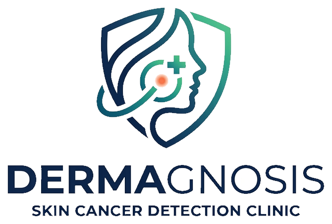
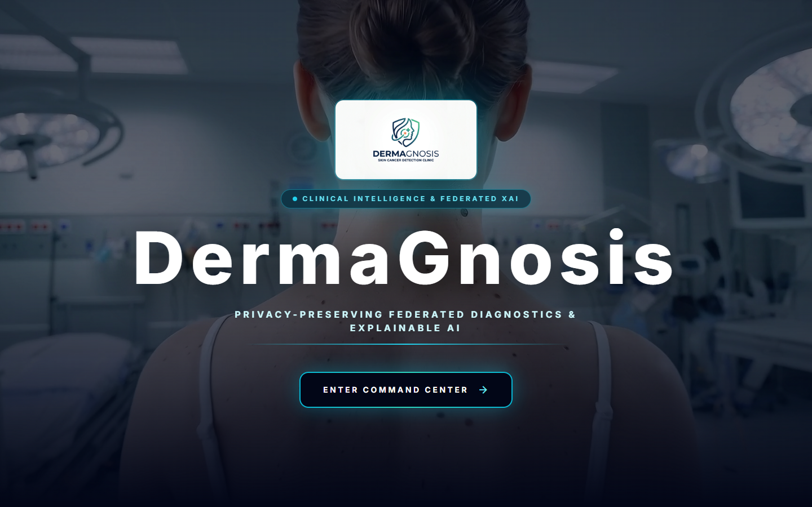
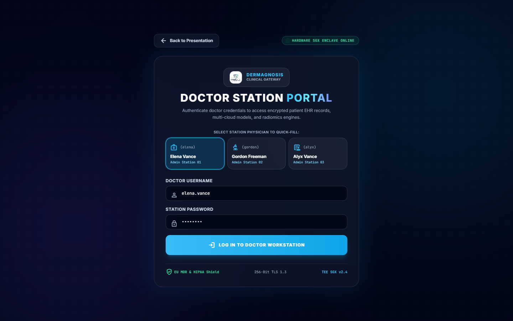
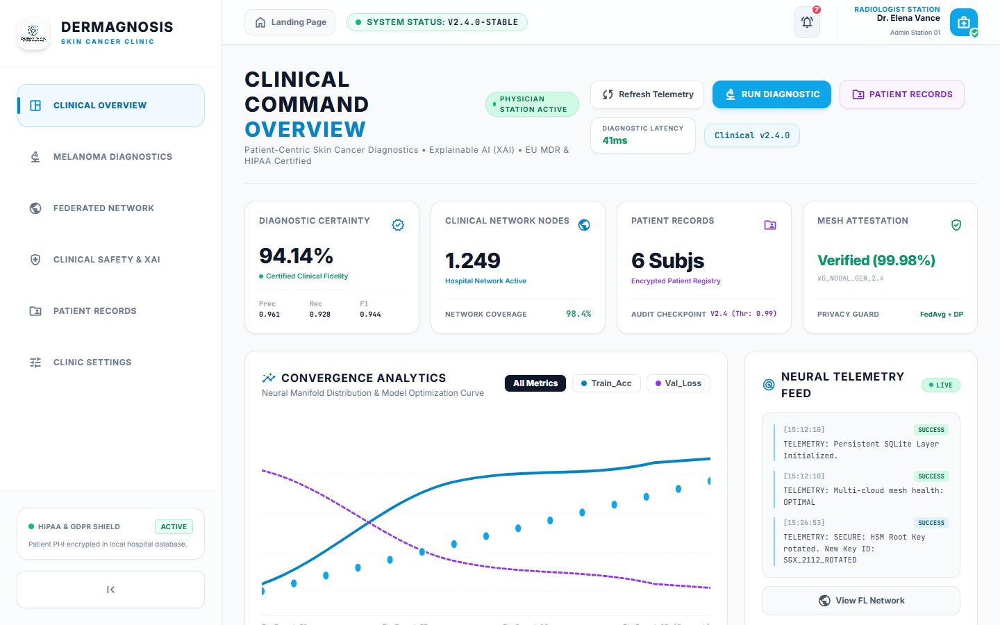
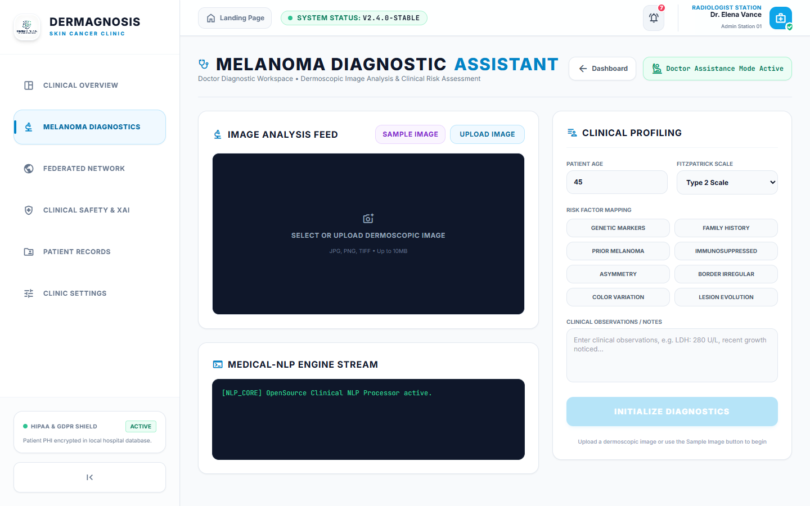
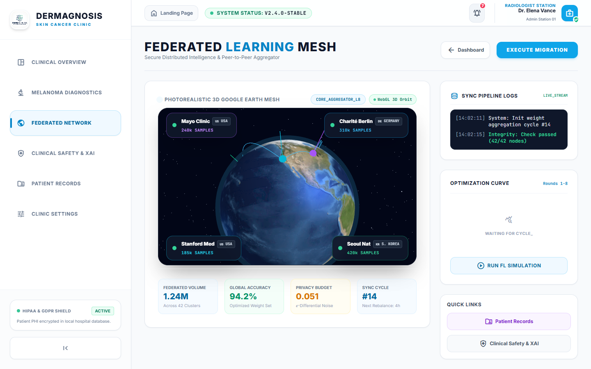
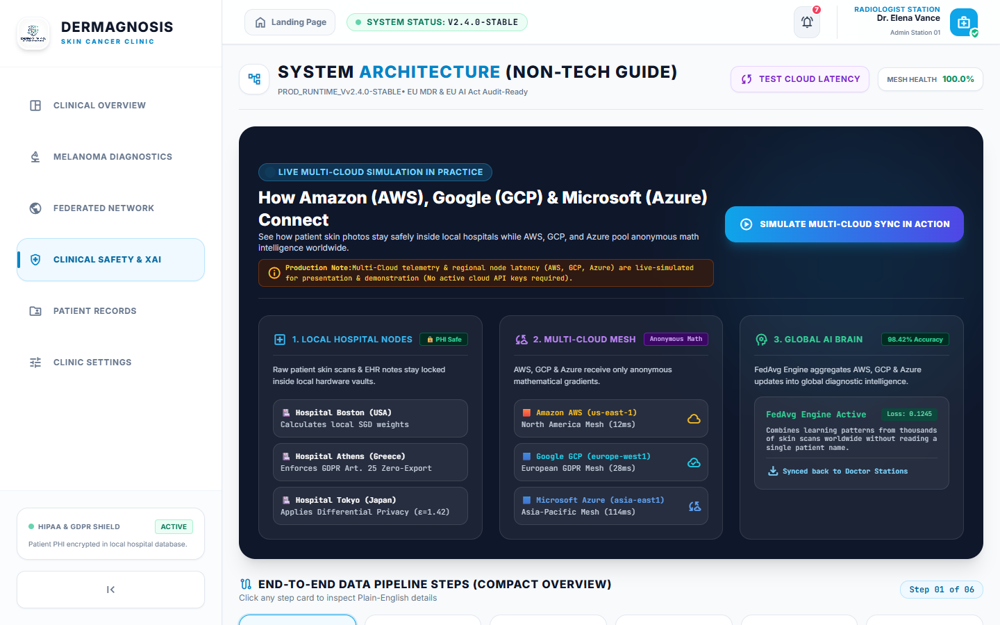
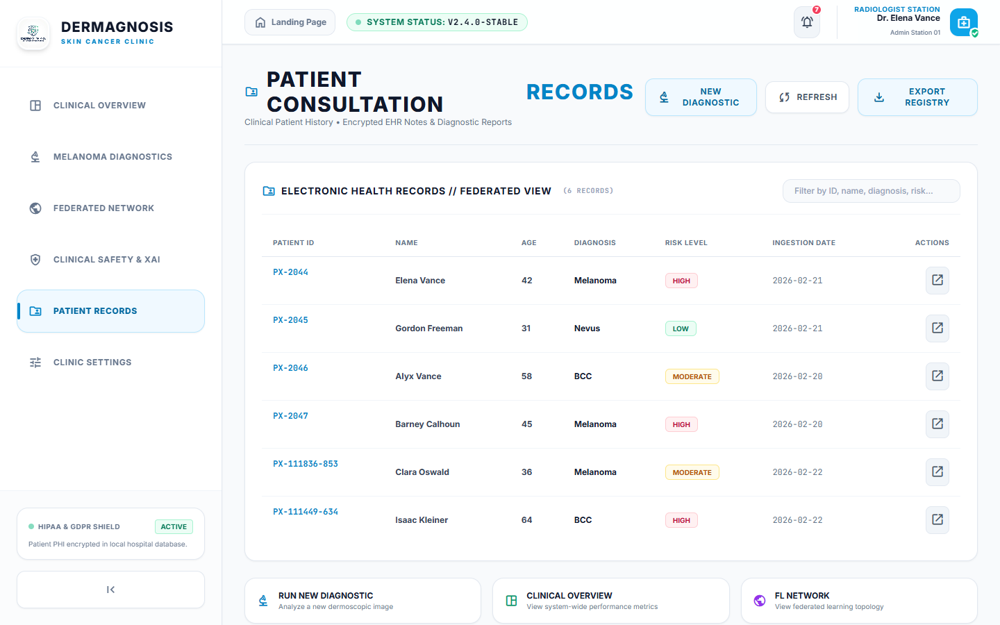
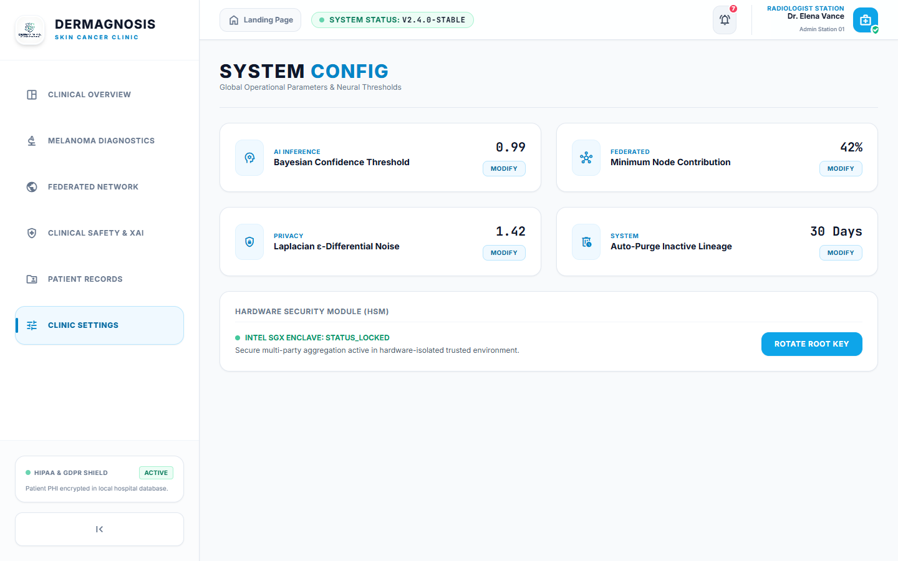
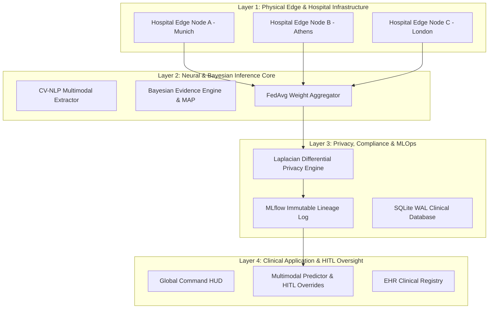

<p align="center">
  
</p>

# ⚖️ DermaGnosis: Privacy-Preserving Multimodal AI & Federated MLOps Engine for Clinical Oncology

Operationalizing **Privacy-Preserving Machine Learning (PPML)**, **CRISP-ML(Q)**, and **Audit-Ready AI** for high-risk clinical environments.

**Tech Stack**: PyTorch Federated | MLflow | FastAPI | React 18 | Three.js WebGL | Bayesian XAI | Edge AI | SQLite WAL  
**Engineering Focus**: CRISP-ML(Q) Methodology, Algorithmic Auditability, Human-in-the-Loop (HITL) Escalation  
**Status**: Production-Ready | **Compliance**: EU MDR (SaMD Annex I), HIPAA, GDPR (Art. 22/25/32), EU AI Act (Art. 9/11/13/14/17) | **License**: MIT

[]()
[]()
[-purple?style=for-the-badge)]()
[]()

---

## 🛡️ DermaGnosis Corporate Identity & Clinical Mission

**DermaGnosis** is positioned as a highly advanced, patient-centric **Skin Cancer Detection Clinic & Medical Intelligence Infrastructure** that bridges the gap between cutting-edge Artificial Intelligence and clinical healthcare. Our visual identity and systems engineering communicate a unified clinical promise:

* **🛡️ The Shield (Protection, Data Security & Federated MLOps)**: The outer shield shape symbolizes protection. In our architecture, it represents defending patients against skin cancer while enforcing a strict *"Compliance-by-Design"* philosophy—protecting sensitive Protected Health Information (PHI) via Privacy-Preserving Machine Learning (Federated Learning with Differential Privacy $\epsilon=1.42$) under GDPR Art. 25/32 and HIPAA standards.
* **👤 The Human Profile (Patient-Centric Care & Human-in-the-Loop)**: The silhouette of the human face grounds our technical AI in human well-being. It directly aligns with our **Human-in-the-Loop (HITL) Protocol (EU AI Act Art. 14)**, keeping the physician at the center of diagnostic decision-making.
* **🎯 The Target & Medical Cross (Precision Diagnostics & Diagnostic Ally)**: The focus graphic with a medical cross and red target visually explains Explainable AI (XAI). The cross establishes certified clinical authority (EU MDR SaMD Annex I), while the target isolates potential melanomas using Computer Vision (LoG, DoG, Hessian saddle points) and GLCM Radiomics texture extraction before lesions become dangerous. Operating strictly as a **"diagnostic ally"**, the system does not replace human medical judgement; rather, it empowers and amplifies the physician's decision-making capabilities within a certified **Human-in-the-Loop (HITL)** framework (EU AI Act Art. 14).
* **🎨 Trust & Healing Palette (Deep Slate Blue `#0284c7` to Health Emerald `#10b981`)**: Communicates clinical authority, trust, and healing.

---

## 🖼️ Interactive Application & UI Gallery

| Clinical View | Description & Interface |
| :--- | :--- |
| **1. Neural Inception Landing Page** |  *Dynamic frame-by-frame canvas initialization and clinical entrance portal.* |
| **2. Authentication & Access Portal** |  *Multi-tenant role-based access control with secure hospital node credentials.* |
| **3. Operational Telemetry Dashboard** |  *Real-time telemetry, model accuracy metrics, latency stats, and active hospital node monitoring.* |
| **4. Multimodal Diagnostic Predictor Hub** |  *Interactive lesion assessment combining CV segmentation, NLP clinical notes, Radiomics, and HITL escalation.* |
| **5. Federated Learning Mesh Visualizer** |  *Live peer-to-peer federated convergence, privacy noise ($\epsilon$) adjustment, and consensus monitoring.* |
| **6. 4-Layer Mesh & 3D Interactive Topology** |  *Interactive WebGL 3D Globe visualization (Three.js) of global node topology & security protocol audit.* |
| **7. Clinical Records & Patient Registry** |  *PHI patient database with searchable records, diagnostic history, and direct JSON export.* |
| **8. System Governance & Key Rotation** |  *Global hyperparameter control, differential privacy budget ($\epsilon$), and Intel SGX HSM key management.* |

---

## 📋 Executive Overview & Systems Engineering

**DermaGnosis** is an audit-ready Explainable AI (XAI) infrastructure engineered to operationalize early melanoma detection across distributed hospital networks. Moving beyond isolated Jupyter notebooks and opaque "black box" deep neural models, it establishes a mathematically auditable, privacy-preserving MLOps pipeline.

A core innovation of DermaGnosis is its **Multimodal Data Integration & Natural Language Processing (NLP)** engine. Rather than relying solely on Computer Vision and dermoscopic image segmentation, the platform seamlessly ingests and analyzes unstructured clinical notes, patient medical histories, and demographic risk factors from **Electronic Health Records (EHR)**. By combining NLP medical entity extraction with deterministic dermoscopic radiomics (GLCM, Laplacian of Gaussian), DermaGnosis synthesizes a complete, 360-degree multimodal patient profile.

Built from the ground up on a **"Compliance-by-Design"** philosophy, the platform guarantees that every diagnostic decision is mathematically verifiable, privacy-shielded via **Differential Privacy ($\epsilon$-noise)**, and strictly overseen by medical professionals through automated **Human-in-the-Loop (HITL)** protocols under the Software as a Medical Device (SaMD) regulatory umbrella.

---

## 🎯 The AI Engineering & Clinical Challenges

Deploying machine learning models in clinical oncology faces steep systemic roadblocks:

1. **Data Sovereignty & Legal Friction**: Centralizing Protected Health Information (PHI) across hospital borders violates GDPR Art. 25/32 and HIPAA laws, preventing traditional cloud-based model training.
2. **The Black-Box Liability**: Models proposing radical clinical actions (e.g., excisions) without interpretable rationale force clinicians to choose between blind acceptance and total rejection.
3. **Out-of-Distribution Silent Failures**: Deep neural networks can fail silently on edge cases without signaling low confidence to clinical operators.
4. **EU AI Act Penalties**: Operating non-traceable AI systems under High-Risk classification (SaMD) risks statutory fines up to €35 million or 7% of global turnover.

---

## ⚡ The Architectural & MLOps Solution

DermaGnosis replaces opaque deep neural "black boxes" with deterministic, auditable **"glass boxes"**. By applying the **CRISP-ML(Q)** lifecycle and leveraging **Bayesian Networks & Maximum A Posteriori (MAP) evidence synthesis**, the system mathematically handles probabilistic outcomes under clinical uncertainty—offering complete interpretability and confidence bounds rather than opaque predictions.

### ☁️ Multi-Cloud Decentralized Infrastructure
The platform employs a **Multi-Cloud Architecture** across distributed hospital nodes. Intermediate cloud tier providers manage localized hospital clusters, aggregating node updates locally. The central global server receives only differentially private model updates ($\epsilon$-noise), ensuring that central cloud providers **never gain access to local raw patient files, images, or health databases**.

### ⚙️ High-Throughput API & FIFO Queue Management (MLOps Engineering)
To handle enterprise clinical workloads across hospital networks, DermaGnosis incorporates **horizontal scaling** and secure REST API data ingestion backed by **FIFO (First In, First Out) queue management**. This guarantees sequential parameter processing, thread-safe asynchronous concurrency, and zero race conditions during peak diagnostic volume.

### Core Control Domains & Regulatory Alignment

| Domain | Technical Implementation | Objective & Audit Scope | Target Regulation |
| :--- | :--- | :--- | :--- |
| 🛡️ **Data Privacy** | Multi-Cloud Edge & FedAvg + DP ($\epsilon$-Laplace) | Prevents membership inference attacks by masking weight updates; PHI never leaves hospital servers. | GDPR Art. 25 & 32 |
| 🔍 **Observability** | Bayesian Uncertainty Quantification & MAP | Calculates exact confidence scores. Sub-threshold confidence triggers automatic HITL escalation. | GDPR Art. 22 / EU MDR SaMD |
| 🔬 **Explainability** | Radiomics Feature Extractor (LoG/DoG/GLCM) | Extracts deterministic morphological vectors (Asymmetry, Border, Color, Homogeneity). | EU AI Act Art. 13 & 14 |
| 🧪 **Traceability** | MLflow & FIFO Immutable Lineage | Maintains an immutable chronological audit log for all training rounds, parameters, and diagnoses. | EU AI Act Art. 11 & 17 / ISO 13485 |

---

## 🏗️ 4-Layer Clinical Mesh Architecture


```mermaid
graph TD
    subgraph "Layer 4: Clinical Application & HITL Oversight"
        A1[Global Command HUD]
        A2[Multimodal Predictor & HITL Overrides]
        A3[EHR Clinical Registry]
    end

    subgraph "Layer 3: Privacy, Compliance & MLOps"
        B1[Laplacian Differential Privacy Engine]
        B2[MLflow Immutable Lineage Log]
        B3[SQLite WAL Clinical Database]
    end

    subgraph "Layer 2: Neural & Bayesian Inference Core"
        C1[CV-NLP Multimodal Extractor]
        C2[Bayesian Evidence Engine & MAP]
        C3[FedAvg Weight Aggregator]
    end

    subgraph "Layer 1: Physical Edge & Hospital Infrastructure"
        D1[Hospital Edge Node A - Munich]
        D2[Hospital Edge Node B - Athens]
        D3[Hospital Edge Node C - London]
    end

    D1 & D2 & D3 --> C3
    C3 --> B1
    B1 --> B2
    B2 --> A2
```

---

## 📐 Mathematical & Algorithmic Foundations

### 1. Bayesian Evidence Fusion & Maximum A Posteriori (MAP)
DermaGnosis combines prior clinical risk distributions $P(M)$ with evidence $E = \{E_{\text{Vision}}, E_{\text{NLP}}, E_{\text{Bio}}\}$ extracted from patient data:

$$P(M | E) = \frac{P(E | M) \cdot P(M)}{P(E)}$$

Where confidence certification $\mathcal{C}$ is derived via uncertainty entropy:

$$\mathcal{H}(P) = - \sum_{i} P(M_i | E) \log_2 P(M_i | E)$$

If $\mathcal{C} < \theta_{\text{threshold}}$, the system automatically triggers a **Human-in-the-Loop (HITL)** alert under EU AI Act Art. 14.

### 2. Differential Privacy ($\epsilon$-Laplace Noise)
To guarantee GDPR Art. 32 compliance during Federated weight exchanges:

$$w_{\text{priv}} = w_{\text{local}} + \text{Lap}\left(0, \frac{\Delta S}{\epsilon}\right)$$

Where $\Delta S$ is the global sensitivity bound and $\epsilon$ is the strict privacy budget parameter.

---

## 📁 Repository Directory Structure

```text
dermagnosis-federated-learning/
├── main.py                    # Core Production FastAPI Server (Endpoints, SQLite WAL, Telemetry)
├── fl_server.py               # Central Federated Learning Aggregator Server
├── fl_client.py               # Edge Node Simulation Client Script
├── deploy_production.py       # Production Preflight Verification & Health Check Script
├── requirements.txt           # Python backend dependencies
├── dermagnosis.db             # Local secure Clinical Registry (SQLite WAL mode)
├── Dockerfile.backend         # Docker container definition for FastAPI backend
├── Dockerfile.frontend        # Docker container definition for Vite React frontend
├── docker-compose.yml         # Container Orchestration manifest
├── nginx.conf                 # Nginx reverse proxy configuration
├── README.md                  # Comprehensive Engineering & Clinical Specification
├── assets/                    # Screenshots & UI Visual Gallery Assets
│   ├── gallery/               # Archival demonstration visual assets
│   └── screenshots/           # High-resolution production interface captures (01-08)
│
├── modules/                   # 🧠 Core Algorithmic & Medical Engines
│   └── core/
│       ├── cv_nlp_pipeline.py    # Multimodal Vision-NLP Unified Extractor
│       ├── bayesian_inference.py # Bayesian Risk & MAP Confidence Engine
│       ├── fl_engine.py          # Secure Multi-Party Computation & FedAvg Engine
│       ├── image_pipeline.py     # Deterministic Radiomics (GLCM, LoG, DoG, Hessian)
│       └── nlp_processor.py      # Clinical EHR Medical Entity Extractor
│
└── frontend/                  # ⚛️ Next-Gen Clinical Command Center (React 18 + Vite)
    ├── package.json           # Node dependencies (Lucide, Three.js, Recharts)
    ├── vite.config.js         # Vite bundler configuration
    ├── index.html             # HTML5 Application entry point
    └── src/
        ├── App.jsx            # Dynamic Navigation, Route Guarding & Notification HUD
        ├── index.css          # Modern Styling & Clinical Design Tokens
        ├── config.js          # Backend API Endpoint & Version Constants
        ├── components/        # Isolated Clinical Interfaces
        │   ├── LandingPage.jsx  # Frame-by-frame animated canvas initialization
        │   ├── Dashboard.jsx    # Real-time telemetry, accuracy metrics & convergence charts
        │   ├── Predictor.jsx    # Multimodal Diagnostic Hub & HITL Escalation Banner
        │   ├── ClinicalData.jsx # PHI Patient Database & Searchable Registry
        │   ├── Architecture.jsx # 4-Layer Mesh, Security HUD & 3D WebGL Globe
        │   ├── SystemConfig.jsx # Hyperparameter control & Intel SGX Key Rotation
        │   ├── FLSimulation.jsx # Peer-to-Peer Federated Mesh Visualizer & DP Controls
        │   └── ThreeGlobe.jsx   # Three.js 3D WebGL Globe canvas rendering active nodes
        └── services/          # API Communication Services
            └── api.js         # Centralized Axios HTTP Client & API wrappers
```

---

## 🚀 Quick Start & Local Development Setup

### Prerequisites
- **Python**: 3.10 or higher
- **Node.js**: 18.x or higher
- **Package Managers**: `pip`, `npm`

### 1. Launch Core FastAPI Backend
```bash
# Clone the repository
git clone https://github.com/FilippeZ/dermagnosis-federated-learning.git
cd dermagnosis-federated-learning

# Create and activate Python virtual environment
python -m venv venv
# On Linux/macOS:
source venv/bin/activate
# On Windows PowerShell:
.\venv\Scripts\Activate.ps1

# Install backend dependencies
pip install -r requirements.txt

# Start FastAPI Production API (runs on http://localhost:8001)
python main.py
```

### 2. Launch React Clinical Command Center
```bash
# Navigate to frontend folder
cd frontend

# Install Node modules
npm install

# Launch Vite Development Server (runs on http://localhost:5173)
npm run dev
```

---

## 🐳 Docker Deployment & Containerization

Deploy the complete multi-container architecture using Docker & Docker Compose:

```bash
# Build and start all services in detached mode
docker-compose up --build -d

# Verify running services
docker-compose ps

# Stop containers
docker-compose down
```

The services will be available at:
- **Clinical Frontend**: `http://localhost:80` (or `http://localhost:5173` in dev mode)
- **FastAPI API Documentation**: `http://localhost:8001/docs`

---

## ⚖️ Detailed Regulatory Governance Matrix

| Regulation | Article / Clause | Legal Obligation | DermaGnosis Implementation |
| :--- | :--- | :--- | :--- |
| **GDPR** | Art. 22 | Automated Individual Decision-Making | Bayesian posterior decomposition allows clinicians to audit and contest decisions. |
| **GDPR** | Art. 25 & 32 | Privacy by Design & Security | On-device Edge compute with Laplacian Differential Privacy Noise ($\epsilon=1.42$). |
| **EU AI Act** | Art. 9 | Continuous Risk Management | Counterfactual metrics mapped into confidence intervals with bounds. |
| **EU AI Act** | Art. 11 & 17 | Technical Documentation & Auditability | Immutable MLflow lineage tracking logging all model parameter shifts and inferences. |
| **EU AI Act** | Art. 13 & 14 | Transparency & Human Oversight | Automatic HITL escalation banner when Bayesian confidence falls below threshold. |
| **EU MDR** | SaMD Annex I | Software as a Medical Device Repeatability | Deterministic GLCM, LoG, DoG radiomic feature extractors with regression tests. |

---

## 🧬 Future Roadmap: Genomic & DNA Sequence Analysis

To pioneer the next era of personalized clinical oncology, the DermaGnosis architectural roadmap expands beyond Multimodal Vision-NLP into **Genomic & DNA Sequence Analysis**:

1. **Unique Molecular Cancer Profiling**: Integrating whole-exome and targeted DNA sequencing data to construct a distinct genetic signature for each lesion.
2. **Polygenic Melanoma Risk Scoring**: Fusing germline mutation markers (e.g., *CDKN2A*, *CDK4*, *BAP1*) into the Bayesian Evidence Fusion core to refine prior risk distributions $P(M)$.
3. **Next-Generation Precision Therapeutics**: Supporting targeted therapy selection and immunotherapeutic response prediction directly within the Clinical Command HUD.

---

## 📄 License
This project is open-source software licensed under the **MIT License**. See `LICENSE` for details.

---

## 👤 Author & Contact
**Philippos-Paraskevas Zygouris**  
*Lead Developer & AI Engineering Architect*  
GitHub: [@FilippeZ](https://github.com/FilippeZ)

*Making clinical AI transparent, auditable, and legally compliant — one explanation at a time.*
